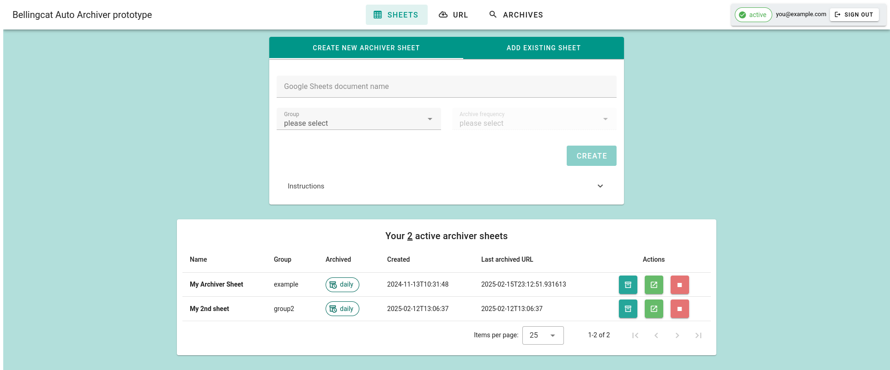

# Aut Archiver Setup Tool
This project is a firebase/vue app that can connect to an instance of the [Auto Archive API](https://github.com/bellingcat/auto-archiver-api).



## development with yarn
```bash
# setup
yarn install

# Compiles and hot-reloads for development
yarn serve

# Compiles and minifies for production
yarn build
# Previews the production build
yarn preview

# Lints and fixes files
yarn lint
```

### Release/development process
> You need a [firebase APP](https://firebase.google.com/) and a Google project, and as it stands you need to update the hardcoded APP identifiers ([here](src/store/index.js) and [here](firebase.json)); a PR on isolating that to .env is welcome.

1. install firebase locally
2. login to your firebase account with `firebase login`
3. make sure you have access to the project `firebase projects:list`
4. build `yarn build` and check with `yarn preview`, once all is good release `firebase deploy --only hosting`
<!-- 5. to update schedule functions `firebase deploy --only functions` currently these are disabled
6. if you add any library to a function, install it inside the `/functions` folder and not in the root folder -->
<!-- 7. to update secrets use `firebase functions:secrets:set SECRET_NAME` more info [here](https://firebase.google.com/docs/functions/config-env?gen=2nd#managing_secrets) -->
   <!-- 1. `API_SERVICE_PASSWORD` for the auto-archiver-api -->
   <!-- 2. `GOOGLE_API_CLIENT_EMAIL` and `GOOGLE_API_PRIVATE_KEY` for the scheduled function to validate sheets exist -->